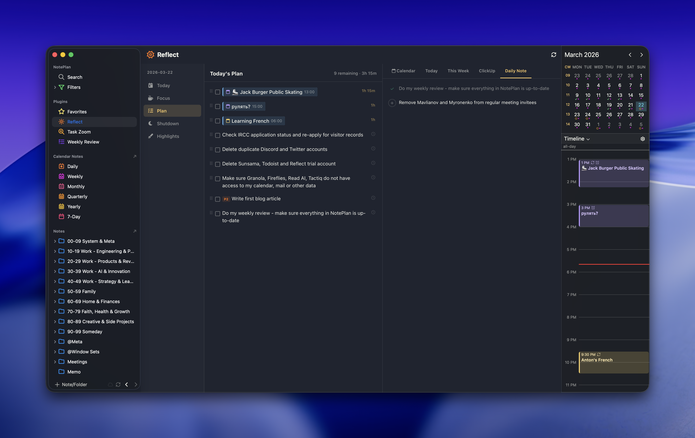
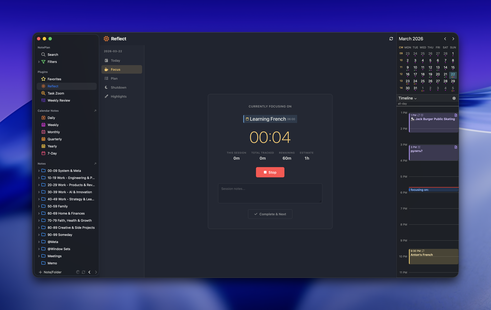
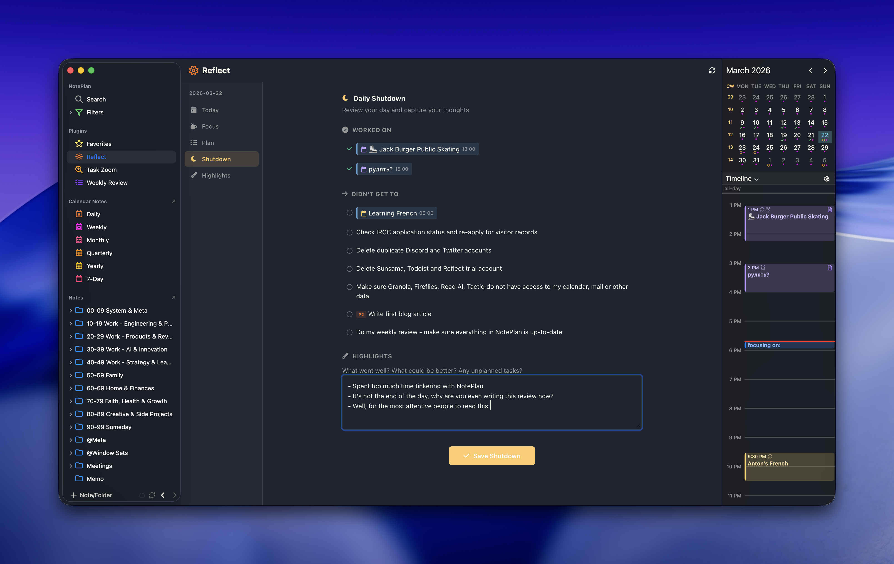
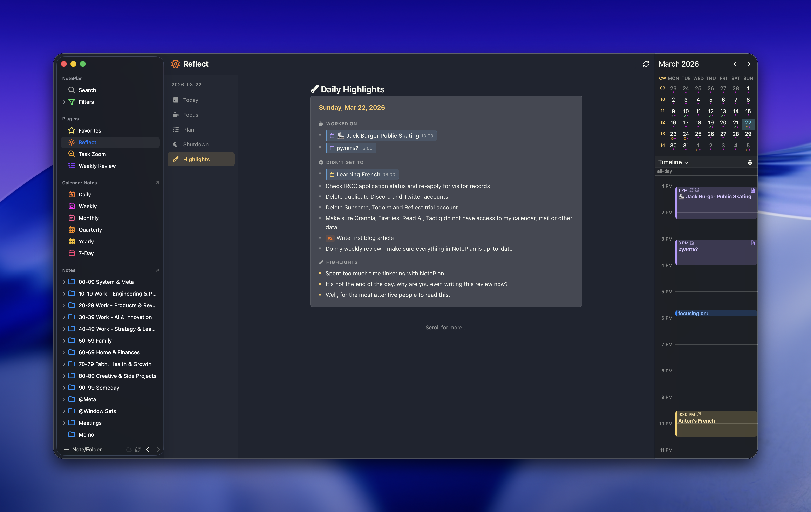

# Reflect for NotePlan

A Sunsama-inspired daily planning, focus, and reflection plugin for [NotePlan](https://noteplan.co). Plan your day, focus on one task at a time, and capture highlights — all from a single sidebar view backed by your daily notes.

## Plan

Build your daily plan by pulling tasks from multiple sources: calendar events, daily note tasks, tasks scheduled for today or this week across your vault, and ClickUp tasks.



- **Multi-source task import** — pull from Calendar, Today's tasks, This Week, ClickUp, and Daily Note tabs
- **Calendar integration** — import calendar events as plan items with proper NotePlan deeplinks and duration
- **Time estimates** — set planned time per task (15m to 8h); total remaining time shown in the header
- **Drag-and-drop reordering** — prioritize your plan by dragging tasks up or down
- **ClickUp integration** — fetch your assigned ClickUp tasks and add them to your plan with a link back to ClickUp
- **Smart deduplication** — tasks already in your plan are marked with a checkmark in the source tabs

## Focus

Work on one task at a time with a built-in focus timer. Track actual time spent vs estimated time.



- **Single-task focus** — shows the current task front and center with a large timer
- **Time tracking** — live timer with breakdown: current session, total tracked, and remaining vs estimate
- **Session notes** — capture thoughts while working; notes are saved as blockquotes under the focus log in your daily note
- **Focus log** — each start/stop is recorded in the daily note under `## Focus` with timestamps
- **Complete & Next** — mark the current task done and automatically advance to the next one

## Shutdown

End your day with a structured review of what you accomplished.



- **Worked on** — auto-populated list of tasks you focused on, with total tracked time
- **Didn't get to** — tasks from your plan that weren't touched or completed
- **Highlights** — free-form text area for reflections: what went well, what blocked you, unplanned work
- **Persistent** — shutdown data is saved under `## Highlights` in your daily note; re-opening loads existing content for editing

## Highlights

Browse your daily reflections in a scrollable feed, from most recent to oldest.



- **Infinite scroll** — loads 5 days at a time, fetches more as you scroll
- **Three sections per day** — Worked on, Didn't get to, and Highlights
- **Full history** — scans all daily calendar notes that have a `## Highlights` section

## Daily Note Structure

Reflect stores everything in your daily note under a `# Reflect` heading:

```markdown
# Reflect
## Plan
+ Task one *- 45m*
+ [x] Completed task
+ ![calendar-event-deeplink] *- 1h*
+ ClickUp task [ClickUp](https://app.clickup.com/t/abc123) *- 2h*

## Focus
- 09:00 *focusing on:* Task one
	> Some notes I took while working
- 09:42 *done focusing on:* Task one (42m)

## Highlights
### Worked on
- Task one *(42m)*

### Didn't get to
- Another task

### Highlights
- Had a productive morning
- Got blocked by a dependency in the afternoon
```

## Installation

1. Copy the `asktru.Reflect` folder into your NotePlan plugins directory:
   ```
   ~/Library/Containers/co.noteplan.NotePlan*/Data/Library/Application Support/co.noteplan.NotePlan*/Plugins/
   ```
2. Restart NotePlan
3. Reflect appears in the sidebar under Plugins

## Settings

- **ClickUp API Token** — your personal ClickUp API token (from Settings > Apps)
- **ClickUp Team/Workspace ID** — your ClickUp workspace ID (visible in the URL)
- **ClickUp User ID** — your ClickUp user ID (for filtering assigned tasks)
- **Excluded Calendars** — comma-separated calendar names to hide (e.g., `NotePlan Timeblocks`)

## License

MIT
